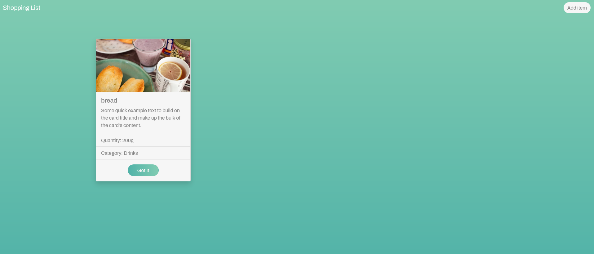
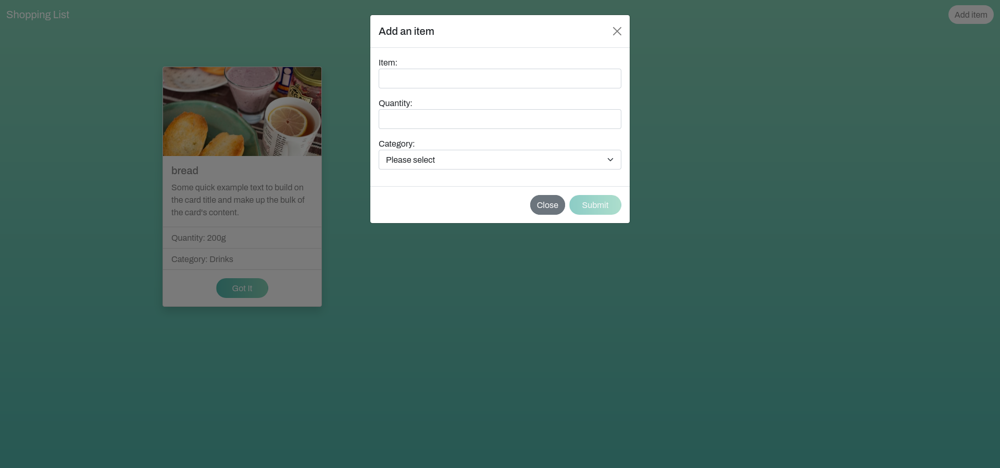
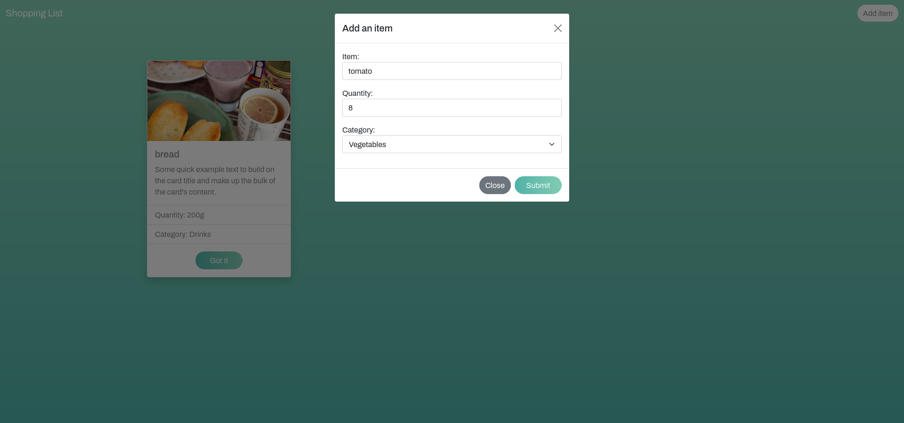
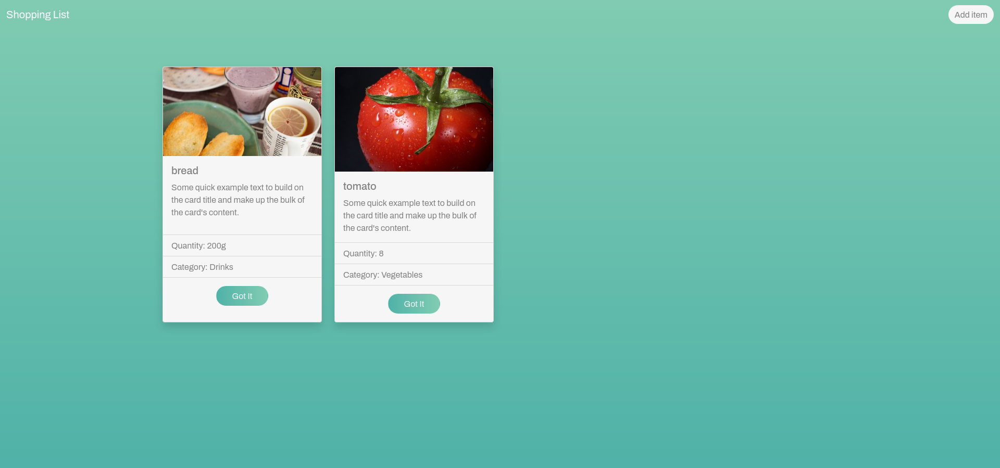

# SHOPPING-LIST
Contributors:  
[Laurent Bosteels](https://github.com/Laurent-Bosteels)  
[Jens De Nijs](https://github.com/JensDeNijs)

## Preview

## TO-DO

- [x] Initiate a new project
- [x] Add bootstrap
- [x] Create a form
- [x] Implement `#formName="ngForm"`
- [x] Make a class " ListItem "
- [x] Add validation to the form
- [x] Submit function
- [x] HTTP request / post to the server
- [x] Subscribe to an observable
- [x] Change the port of the server
- [x] Make a post function with the right path
- [x] Get request
- [x] Use the OnInit function
- [x] Display all data
- [x] CSS/Bootstrap

## Nice to haves
- [x] Unsplash.com API for product pictures
- [x] Mark as done function
- [x] Delete/Edit button
- [x] Make the list responsive

### Extra nice to haves
- [ ] Add a recipe to the item
- [ ] Allergies API
- [ ] Compact view

## How to run the project
- Clone the repo to your local folder
- Navigate with the terminal to the project directory and run `ng serve --port 4500` in your terminal
- You can visit the page at http://localhost:4500/
- Then navigate with the terminal to the server directory and run `node server`
- Everything is all set up! add some products!

